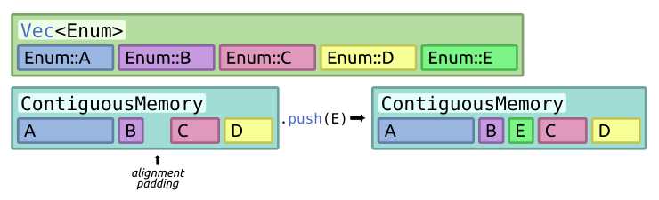

# contiguous_mem

contiguous_mem is space optimized a vector like collection that can store
entries of **varying layouts** **close in memory** while retaining type
information at the reference level.

[](https://crates.io/crates/contiguous_mem)
[](https://docs.rs/contiguous-mem)
[](https://github.com/Caellian/contiguous_mem/actions/workflows/rust.yml)
[](https://github.com/Caellian/contiguous_mem#license)

## Use Case

<br/>
<sup>* Both <code>Vec</code> and <code>ContiguousMemory</code> have <em>one</em>
level of indirection that's not shown for sake of simplicity.</sup>

You need to store several different types and ensure their close proximity on
the heap to reduce cache misses, but which/how many is determined at runtime.

### Key Features

- `no_std` support!
- Interface similar to `Vec`.
- Support for dynamic resizing of allocated memory while keeping the existing
  references functional (for safe implementations).
- Exhaustively tested with Miri.
- No downstream dependencies.
  - ...almost, only [sptr](https://crates.io/crates/sptr) is used to ensure safety.

## Getting Started

Add the crate to your dependencies:

```toml
[dependencies]
contiguous_mem = { version = "0.5" }
```

Optionally enable `no_std` feature to use in `no_std` environment:

```toml
[dependencies]
contiguous_mem = { version = "0.5", features = ["no_std"] }
```

### Features

- `no_std` - enables `no_std` dependencies for atomics, mutexes and rwlocks
- `debug` - enables `derive(Debug)` on structures unrelated to error handling
- [`ptr_metadata`](https://doc.rust-lang.org/beta/unstable-book/library-features/ptr-metadata.html)
  &lt;_nightly_&gt; - allows casting references into `dyn Trait`
- [`error_in_core`](https://dev-doc.rust-lang.org/stable/unstable-book/library-features/error-in-core.html)
  &lt;_nightly_&gt; - enables support for `core::error::Error` in `no_std`
  environment
- [`allocator_api`](https://dev-doc.rust-lang.org/stable/unstable-book/library-features/allocator-api.html)
  &lt;_nightly_&gt; - enables automatic support for custom allocators
- `unsafe_impl` (default) - enables `UnsafeContiguousMemory`

### Usage

```rust
use contiguous_mem::*;

#[derive(Debug, Clone, Copy, PartialEq, Eq)]
struct Data {
    value: u32,
}

fn main() {
    // Create a ContiguousMemory instance
    let mut memory = ContiguousMemory::new();

    // Store data in the memory container
    let data = Data { value: 42 };
    let stored_number: ContiguousEntryRef<u64, _> = memory.push(22u64);
    let stored_data: ContiguousEntryRef<Data, _> = memory.push(data);

    // Retrieve and use the stored data
    assert_eq!(*stored_data.get(), data);
    assert_eq!(*stored_number.get(), 22);
}
```
<sub>* Note that reference types returned by store are inferred and only shown
here for demonstration purposes.</sub>

References have a similar API as [`RefCell`](https://doc.rust-lang.org/stable/std/cell/struct.RefCell.html).

For more usage examples see the
[examples](https://github.com/Caellian/contiguous_mem/tree/trunk/examples)
directory.

## Stability

This crate has almost complete test coverage and is tested with Miri. It doesn't
rely on any weird language quirks, but it _does_ deal with memory management.

There's a lot of unsafe code due to the nature of the crate, but again, it's
covered by tests and Miri.

## Alternatives

- manually managing memory to ensure contiguous placement of data
  - prone to errors and requires unsafe code
- multiple levels of indirection (`Vec<Box<dyn Trait>>`)
- for storing types with **uniform** `Layout`, when you only need to erase their
  types at the container level see:
  - [`any_vec`](https://crates.io/crates/any_vec)
  - [`type_erased_vec`](https://crates.io/crates/type_erased_vec)
  - [`untyped_vec`](https://crates.io/crates/untyped_vec)
- using a custom allocator like
  [blink-alloc](https://crates.io/crates/blink-alloc) to ensure contiguous
  placement of data
  - requires [`allocator_api`](https://doc.rust-lang.org/beta/unstable-book/library-features/allocator-api.html)
    feature
  - `blink-alloc` provides a similar functionality as this crate without the
    `allocator_api` feature; intended for use in loops so it doesn't support
    freeing _some_ values while retaining other

## Contributions

Contributions are welcome, feel free to
[create an issue](https://github.com/Caellian/contiguous_mem/issues) or a
[pull request](https://github.com/Caellian/contiguous_mem/pulls).

All contributions to the project are licensed under the Zlib/MIT/Apache 2.0
license unless you explicitly state otherwise.

## License

This project is licensed under [Zlib](./LICENSE_ZLIB), [MIT](./LICENSE_MIT), or
[Apache-2.0](./LICENSE_APACHE) license, choose whichever suits your use case the
best.
